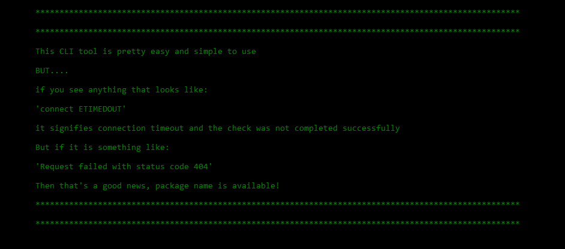
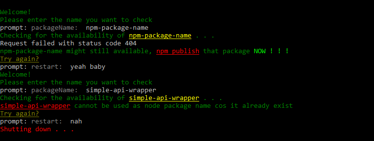

# Intro

A simple CLI tool that helps to check if a package name is available for use on npm registry

# Installation

`- git clone/download repo` <br>

`- run 'npm install' command in project directory` <br>

`- start tool with 'node app.js' command` <br>

# Usage

```
This CLI tool is pretty easy and simple to use
BUT....
if you see anything that looks like:
    'connect ETIMEDOUT'
    it signifies connection timeout and the check was not completed successfully
But if it is something like:
    'Request failed with status code 404'
    Then that's a good news, package name is available!

```


<hr>
